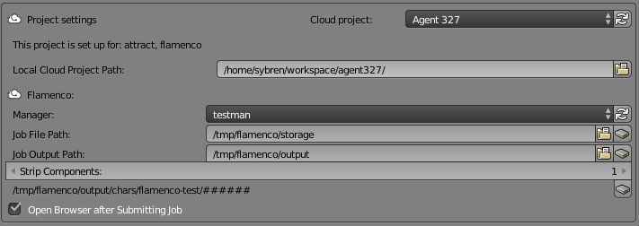

# Blender Render

Rendering with Blender requires a Flamenco client. At the moment of writing two clients are 
available:

- The [Blender Cloud add-on](https://cloud.blender.org/services#blender-addon) version 1.6.2 or 
  newer
- The CLI client shipped with Flamenco Server. This is more for testing purposes than a
  full-fledged, user-friendly client

There are two types of Blender render jobs available: "**Simple Render**" and
"**Progressive Render**". The former simply renders frames, similar to what would happen when you 
click the "Animation" button. The latter only supports Cycles, and renders all frames with a low 
sample count first, and then progressively improves render quality by increasing the sample count.

## Configuring the Blender Cloud add-on

In the Blender User Preferences, install & activate the 
[Blender Cloud add-on](https://cloud.blender.org/services#blender-addon). Version 1.6.2 or newer is
required to interface with Flamenco. Furthermore, your project should be set up for Flamenco, which
is something only server administrators can do at the moment.

!!! note
    We care about your privacy. The Blender Cloud add-on will never access anything on remote 
    servers without an explicit action on your part. As a result, many choices will be initially
    empty, or may be outdated, until you explicitly refresh them.

1. Select your Flamenco project. If this project doesn't show up, or if the Flamenco panel doesn't 
   show when you select your Flamenco project, press the refresh button.
2. Choose your Local Cloud Project Path. For reliable results, we recommend using an absolute path.
   This path should point at the top-level directory of your project.
3. Choose your Flamenco Manager. Again, if it doesn't show up, press the refresh button.
4. Choose the Job File Path (also known as the Storage Path), which is where Blender will copy the
   files needed for the render job.
5. Choose the Job Output Path. This will be extended with components from the current path of the 
   blend file relative to the Local Attract Project Path. In the example in the screenshot above, 
   the blendfile was stored in `/home/sybren/workspace/agent327/lib/chars/flamenco-test.blend`. The
   path relative to the project directory is `lib/chars/flamenco-test.blend`, the first component
   `lib/` was taken off because Strip Components was set to 1.

## Step-by-step overview of the process

To render a file `awesome-animation.blend`, use the following steps. We assume you have
already installed, enabled, and set up the Blender Cloud add-on (if not, see above).

1. Open `awesome-animation.blend` in Blender.
2. Set the render options to render individual images, and not video files.
3. Set the Flamenco options (details are described below).
4. Click the "Render on Flamenco" button.

Flamenco now performs the following steps.

1. Change some settings:
    - Un-check the "Overwrite" and "Placeholders" settings in the "Output" panel.
    - Check the "Use File Extensions" setting in the "Output" panel.
2. Save the file to `awesome-animation.flamenco.blend` in the Storage Directory.
3. Save all the requirements (external textures, linked blend files, etc.) in the Storage Directory.
4. Revert the settings changed in step 1. so that your file hasn't changed; the changed settings are 
   only saved in the `awesome-animation.flamenco.blend` file.
5. Create a render job on the Flamenco Server, which will include the path to
   `awesome-animation.flamenco.blend` and the Flamenco settings you configured. The resulting job 
   definition is also stored in the Storage Directory.
6. Blender opens a webbrowser to show you the job and its tasks.
7. Your configured Flamenco Manager (see 
   [Configuring the Blender Cloud add-on](#configuring-the-blender-cloud-add-on)) picks up the job,
   and distributes its tasks to its Flamenco Workers.

!!! note
    Blender doesn't save your blend file `awesome-animation.blend`. You can thus make changes and
    send them to Flamenco without overwriting any of your files on disk.

## Re-rendering frames

Flamenco tries to be as careful as possible with already-rendered frames. To re-render a frame, make
sure you delete it in from the Output Directory first, before re-queueing a render task.

## Assumptions

- The Storage and Output paths must be the same on the machine submitting the job to Flamenco and on
  all the workers. We suggest mounting an NFS or CIFS share on each machine at the same mount point.
- Each render job has its own output directory. If not, jobs may overwrite or delete each other's
  files.

## Specifics: Simple Render

The "Simple Render" job type performs frame-by-frame rendering. Roughly, the tasks are:

- A render task for each "Frame Chunk Size" frames. Each render task outputs to an intermediate 
  directory next to the Output Directory.
- After all render tasks are completed, if the Output Directory already exists, it is moved apart
  (by appending its last modification timestamp to the name).
- The intermediate directory is renamed to the Output Directory.

!!! note
    This render type does *not require* rendering as images. If you configure Blender to output to
    video files, it will do so. However, the videos will be named the same for each render task and
    be overwritten, so this is not a good way to go.

## Specifics: Progressive Render

The "Progressive Render" job type performs frame-by-frame rendering using a low number of Cycles
samples per frame. It then continues to render, progressively improving the rendered quality.
Roughly, the tasks are:

- Destroy a left-over intermediate directory, if it exists.
- Render all frames with the first sample chunk.
- If the Output Directory already exists, it is moved apart (by appending its last modification
  timestamp to the name).
- The low-sample renders are copied into the Output Directory.
- Render all frames with the second sample chunk.
- Merge the samples of the first and second sample chunk frames, and copy into the Output Directory.
- Continue until all sample chunks are rendered and merged.

!!! note
    This render type *requires* rendering to the EXR image format. The Blender Cloud add-on takes
    care of this for you, by updating the render output settings in the `filename.flamenco.blend`
    file sent to Flamenco. Your file will not be touched.
